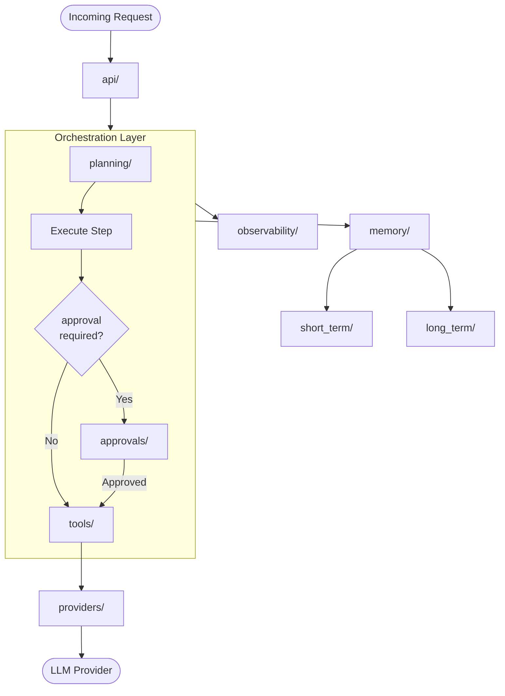

# Agent System Skeleton

A clean, modular skeleton for building AI agent systems in a structured and extensible way.

This template is meant for projects where agents do more than generate answers.  
It supports systems that use tools, manage memory, coordinate flows, expose APIs, and keep clear architectural boundaries.

> “I don’t build AI models — I structure and productionize AI systems.”

---

## Purpose

This skeleton provides a stable foundation for agent-based AI systems without forcing implementation choices too early.

It helps define:

- how agents are organized
- how tools are connected
- how memory is separated
- how orchestration is structured
- how the system is exposed through APIs
- how evaluation, observability, and testing are arranged

It is focused on **system structure**, not model experimentation.

---

## What this skeleton is for

Use this skeleton when the project includes one or more of the following:

- AI agents with defined roles
- tool usage
- memory layers
- orchestration between components
- API exposure
- evaluation and monitoring
- Docker-based execution
- production-style project organization

Typical examples:

- agent assistants
- tool-using AI systems
- task execution agents
- multi-step reasoning systems
- planner / executor / supervisor patterns
- internal AI automation systems

---

## What is included

This skeleton includes a clean structure for:

- **agents/** — agent roles and boundaries
- **tools/** — external capabilities available to agents
- **memory/** — short-term and long-term memory structure
- **orchestration/** — execution flow and coordination
- **api/** — service exposure layer
- **evaluation/** — validation and quality checks
- **observability/** — logs, traces, and monitoring hooks
- **tests/** — testing structure
- **docker/** — container support
- **docs/** — supporting documentation

It also includes essential root-level files such as:

- `README.md`
- `.env.example`
- `requirements.txt`
- `Dockerfile`
- `docker-compose.yml`
- `.gitignore`
- `main.py`

---

## What is NOT included

This skeleton does **not** define implementation-specific AI choices.

It intentionally does not include:

- real model logic
- prompts
- business logic
- hardcoded workflows
- production queries
- tool credentials
- vendor lock-in
- full agent pipelines

This keeps the template reusable across different agent system designs.

---

## Design principles

### 1. Structure before implementation
Define where things belong before deciding how they work.

### 2. Separation of concerns
Agents, tools, memory, orchestration, API, and observability should remain clearly separated.

### 3. Replaceable components
The model, tool provider, vector database, or orchestration strategy should be replaceable later without rewriting the whole structure.

### 4. Production-minded organization
Even in early stages, the project should be organized in a way that supports scaling, debugging, and deployment.

### 5. Framework flexibility
This skeleton should remain usable with FastAPI, LangGraph, custom orchestration, or other frameworks.

---

## Recommended workflow

A typical way to use this skeleton:

1. Identify that the project is agent-based
2. Copy the skeleton
3. Define agent roles
4. Connect tools and external services
5. Add memory boundaries if needed
6. Implement orchestration flow
7. Expose the system through API
8. Add tests, logging, and monitoring
9. Run locally
10. Stabilize with Docker

---

## Architecture Diagram

---

## Folder overview

### `agents/`
Contains the structural definition of agent roles.

Examples:
- planner
- executor
- supervisor
- reviewer
- router

This is where agent responsibilities are separated.

---

### `tools/`
Contains abstractions or wrappers for tools the agents can use.

Examples:
- API clients
- database access wrappers
- search tools
- internal service connectors

This folder defines **capabilities**, not orchestration.

---

### `memory/`
Contains memory-related structure.

Examples:
- short-term memory interfaces
- long-term memory connectors
- state storage abstractions
- session context layers

This folder keeps memory concerns separate from agent logic.

---

### `orchestration/`
Contains the high-level execution flow.

Examples:
- routing between agents
- workflow definitions
- execution chains
- task lifecycle coordination

This is where system behavior is structured at a high level.

---

### `api/`
Contains the external interface of the system.

Examples:
- FastAPI routes
- schema definitions
- request / response contracts
- health endpoints

This layer exposes the system without holding the core logic itself.

---

### `evaluation/`
Contains how the system is reviewed and measured.

Examples:
- scenario evaluation
- agent behavior checks
- tool usage validation
- output quality checks

Useful during development and later hardening.

---

### `observability/`
Contains monitoring and debugging foundations.

Examples:
- structured logging
- tracing hooks
- metrics wiring
- audit-style execution visibility

Useful for understanding agent behavior in real systems.

---

### `tests/`
Contains the testing structure.

Examples:
- unit tests
- integration tests
- orchestration tests
- end-to-end agent scenarios

---

### `docker/`
Contains Docker-related helper files if needed.

Examples:
- support scripts
- compose fragments
- environment-specific helpers

---

### `docs/`
Contains architecture and project documentation.

Examples:
- system diagrams
- integration notes
- run instructions
- deployment notes
- design decisions

---

## Minimal run flow

At skeleton level, the project should be able to:

- install dependencies
- start a minimal API
- confirm the service is running
- provide a clean place for future implementation

Example:

- `main.py` starts the application
- `Dockerfile` builds the service
- `docker-compose.yml` runs it locally
- `.env.example` shows expected configuration

---

## Suggested future additions

Depending on the real project, you may later add:

- `config/`
- `schemas/`
- `services/`
- `clients/`
- `adapters/`
- `pipelines/`
- `registry/`
- `security/`

These are optional and should be added only when needed.

---

## Who this template is for

This template is useful for:

- AI engineering students
- applied AI developers
- backend engineers building agent systems
- MLOps / AI platform engineers
- teams that want a reusable foundation
- anyone moving from experiments to structured AI applications

---

## Philosophy

This skeleton is not about choosing the smartest model first.

It is about building the correct foundation first.

A good agent system is not just “an LLM with tools.”  
It is a structured software system with clear boundaries, extensibility, observability, and testability.

That is the purpose of this skeleton.

---

## Final note

This template gives you the structure.  
The real project adds the logic.

The skeleton defines:

- where things live
- how components connect
- how the system runs
- how it is tested
- how it is observed

The project later decides:

- which model to use
- which prompt strategy to use
- which tools are real
- which workflows are required
- which business logic matters

---

## License

This project is licensed under the MIT License.  
See the `LICENSE` file for details.