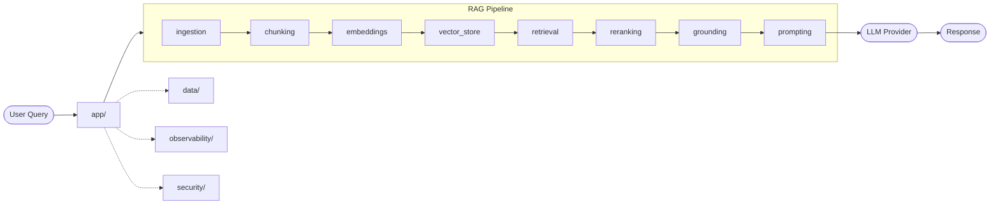

# RAG System Skeleton

## Overview

This repository provides a reusable structural foundation for building Retrieval-Augmented Generation (RAG) systems.

The goal is not to enforce a rigid template, but to define a stable default structure that can be reused, scanned, adjusted, reduced, or expanded per project.

In practice, this skeleton is a starting point:

- keep what is relevant  
- remove what is unnecessary  
- add what is missing  
- stay as close as possible to a consistent structure  

This helps maintain clarity, consistency, and speed across RAG projects.

---

## Purpose

This skeleton provides a clean project layout for RAG systems that may later include:

- document ingestion  
- parsing and preprocessing  
- chunking  
- embeddings  
- vector storage  
- retrieval  
- reranking  
- grounding  
- prompt construction  
- evaluation  
- backend APIs  
- infrastructure and deployment  
- testing and documentation  

It is focused on **structure first**, not implementation.

---

## Design Philosophy

**Start with a strong default structure, then adapt per project.**

Not every project will:

- use every folder  
- follow the exact same flow  
- require the same infrastructure or storage  
- expose the same API  

That is expected.

This skeleton exists so projects start from an organized baseline instead of from zero.

---

## Expected Workflow

When using this skeleton:

1. scan project requirements  
2. compare against the skeleton  
3. keep relevant parts  
4. remove unused parts  
5. add only what is truly needed  
6. preserve overall structure when possible  

---

## What is Included

This skeleton provides:

- a clean root layout  
- separation between application layer and RAG layer  
- dedicated areas for data, tests, docs, and infrastructure  
- placeholder structure for common RAG responsibilities  
- minimal root files  
- README-based guidance  

---

## What is NOT Included

This skeleton does **not** include:

- business logic  
- implemented APIs  
- LLM integrations  
- embedding providers  
- vector database implementations  
- retrieval pipelines  
- deployment configuration  
- frontend implementation  
- observability setup  

These should be added only when required by a real project.

---

## High-Level Structure

### `app/`
Application-facing layer.

Includes:
- API exposure  
- schemas  
- orchestration  
- services  
- configuration  

---

### `rag/`
Core RAG pipeline.

Includes:
- ingestion  
- chunking  
- embeddings  
- vector storage  
- retrieval  
- reranking  
- grounding  
- prompting  
- evaluation  

---

### `data/`
Data organization.

- raw data  
- processed data  
- samples  

---

### `tests/`
Testing structure.

- unit tests  
- integration tests  
- evaluation checks  

---

### `docs/`
Documentation.

- architecture notes  
- flows  
- decisions  
- diagrams  

---

### `infra/`
Infrastructure support.

- Docker  
- Terraform  
- setup scripts  

---

### `notebooks/`
Exploration layer.

- experiments  
- comparisons  
- research  

---

### `examples/`
Usage examples.

- simple flows  
- quick validation  
- onboarding reference  

---

## Architecture Diagram

---

## Why This Structure

A consistent starting point enables:

- faster setup  
- consistent architecture  
- easier onboarding  
- better documentation  
- clearer ownership  
- easier handoff  
- faster adaptation  

It also allows AI agents to quickly understand:

- what fits  
- what should change  
- what is missing  

---

## Adaptation Rule

This structure is a **base, not a constraint**.

For each project:

- keep what is useful  
- remove what is not  
- add only when needed  
- preserve structure when possible  

---

## Recommended Usage

Use this skeleton for:

- knowledge assistants  
- document Q&A systems  
- enterprise search  
- AI copilots with retrieval  
- RAG experiments  
- backend-first AI systems  

---

## Suggested Next Steps

When converting to a real project:

1. define scope  
2. remove unused folders  
3. add missing structure  
4. configure environment  
5. define ingestion  
6. define chunking  
7. choose embeddings  
8. choose vector store  
9. define retrieval  
10. define grounding  
11. add tests  
12. add docs  
13. add infra only if needed  

---

## Final Note

This repository is meant to be reused across projects.

Its value comes from providing a stable baseline that can be adjusted instead of rebuilt.

**Reuse structure. Change only what is necessary.**

---

## License

This project is licensed under the MIT License.  
See the `LICENSE` file for details.