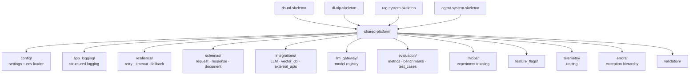

# Shared Platform Skeleton

A reusable infrastructure foundation for AI systems.

This skeleton provides a clean, consistent, and production-oriented platform layer that can be shared across different AI system types:

- DS / ML systems  
- DL / NLP systems  
- RAG systems  
- Agent systems  
- Hybrid AI applications  

It does **not** include business logic, model logic, prompts, pipelines, or project-specific implementation.

---

## Purpose

The purpose of this skeleton is to avoid rebuilding the same infrastructure layer in every project.

Instead, it provides a reusable base for:

- configuration management  
- environment handling  
- logging  
- error handling  
- validation  
- retry patterns  
- shared utilities  
- Docker bootstrapping  
- CI readiness
- - secrets management abstraction  
- resilience patterns (retry, timeout, fallback)  
- shared data schemas (request/response/documents)  
- integration contracts (LLM, vector DB, external APIs)  
- evaluation foundations (metrics, benchmarks, test cases)  
- experiment tracking support (MLOps-ready)  
- feature flags for controlled behavior  

This leads to:

- faster setup  
- better consistency  
- easier maintenance  
- clearer separation between infrastructure and application logic  

---

## What this skeleton is

This repository is a **platform foundation**.

It defines how common technical concerns are structured across projects.

Examples:

- how settings are loaded  
- how logging is configured  
- how errors are structured  
- how validation is handled  
- how retry logic is reused  
- how Docker startup is standardized
- - how secrets are accessed and managed  
- how external integrations are abstracted  
- how system data contracts are enforced  
- how evaluation is structured across systems  
- how resilience is applied to unstable operations (LLMs / APIs)    

---

## What this skeleton is NOT

This repository is not a project by itself.

It does not contain:

- business logic  
- model logic  
- pipelines  
- orchestration logic  
- API endpoints  
- frontend code  
- domain-specific utilities  

Anything project-specific should live outside this layer.

---

## Core Principle

**Structure first. Logic later.**

Typical usage:

1. copy the relevant system skeleton  
2. add this shared platform  
3. remove what is not needed  
4. add missing infrastructure  
5. implement project-specific logic  

---

## Architecture Diagram



---

## Architecture Role

The `shared-platform` layer acts as the base for other skeletons:

- `ds-ml-skeleton`  
- `dl-nlp-skeleton`  
- `rag-system-skeleton`  
- `agent-system-skeleton`  

In real projects, it is usually combined with one or more system skeletons.

Example:

- `shared-platform` + `rag-system-skeleton`  
- `shared-platform` + `agent-system-skeleton`  

This layer remains responsible for **infrastructure only**.

---

## Repository Structure

```text
shared-platform/
├── app_logging/
├── base/
├── ci/
├── config/
├── connectors/
├── docker/
├── errors/
├── evaluation/
│   ├── benchmarks/
│   ├── metrics/
│   └── test_cases/
├── feature_flags/
├── integrations/
│   ├── external_apis/
│   ├── llm/
│   │   ├── base_llm_client.py
│   │   └── prompt_template.py
│   └── vector_db/
├── llm_gateway/
├── mlops/
│   └── experiment_tracking/
├── providers/
├── resilience/
├── schemas/
├── security_baselines/
├── telemetry/
├── tests/
├── utils/
├── validation/
├── docs/
├── main.py
├── README.md
├── .env.example
├── .dockerignore
├── pyproject.toml
├── Dockerfile
└── docker-compose.yml
```

---

## Directory Overview
- app_logging/ — logging configuration and formatters
- base/ — optional base abstractions (BaseService, BaseComponent)
- ci/ — CI templates or minimal pipeline assets
- config/ — environment and settings management
- docker/ — Docker helpers and runtime support
- errors/ — shared exception hierarchy
- evaluation/ — evaluation structure for metrics, benchmarks, and test cases
- feature_flags/ — environment-based feature toggles
- integrations/llm/ — base LLM client contract + PromptTemplate
- integrations/vector_db/ — base vector database client contract
- integrations/external_apis/ — base external API client
- llm_gateway/ — model registry for provider/model selection
- mlops/experiment_tracking/ — experiment run tracking abstraction
- providers/ — provider base abstraction
- resilience/ — retry, timeout, and fallback utilities for unstable operations
- schemas/ — shared data contracts (request, response, document, tool)
- security_baselines/ — approval contracts and security guards
- telemetry/ — lightweight tracing context manager
- utils/ — generic helpers (id, text, time, paths)
- validation/ — input validation helpers
- tests/ — infrastructure-level test suite
- docs/ — integration and usage notes

---

## Required Root Files
- README.md — explains structure and usage
- .env.example — documents environment variables
- .gitignore — excludes local and generated files
- pyproject.toml — Python project configuration
- Dockerfile — container baseline
- docker-compose.yml — local runtime setup
- main.py — minimal bootstrap entry

---

## Usage Pattern

Typical workflow:

- identify system type
- copy relevant skeleton
- add shared-platform
- remove unused parts
- implement project logic

This ensures a structured starting point instead of an empty repository.

---

## Working with AI Coding Agents

Recommended approach:

- let the agent scan the repository
- provide the system specification
- ask for a comparison against the skeleton
- generate an implementation plan
- only then start coding

---

## Engineering Rules
- keep everything reusable
- no business logic
- no model logic
- no prompts
- no project-specific endpoints
- keep code minimal
- prefer clarity over complexity

---

## What belongs here

Examples:

- settings loader
- logging setup
- reusable exceptions
- validation helpers
- retry, timeout, and fallback utilities
- generic helpers
- base abstractions
- Docker helpers
- secret access abstraction
- shared schemas (request / response / document)
- base integration clients (LLM, vector DB, APIs)
- prompt template utility (infrastructure-level, not business-specific prompts)
- evaluation contracts and helpers
- experiment tracking utilities
- feature flag management

---

## What does NOT belong here

Examples:

- RAG pipelines
- agent orchestration
- business-specific prompts and templates
- API routes
- UI components
- notebooks
- training code
- project-specific logic

---

## Minimal Run

The platform should support a minimal run that verifies:

- environment loads
- config initializes
- logging works
- - secrets load correctly  
- timeout and fallback mechanisms work  
- schema layer is accessible  
- base integrations can be initialized (no real API calls required)  

Nothing more.

---

## Testing

Tests should validate infrastructure only:

- config loading
- retry behavior
- validation logic
- error handling
- - schema validation consistency  
- retry / timeout / fallback behavior  
- integration contract integrity (mock-based)  
- feature flag behavior  

They should remain fast and lightweight.

---

## Docker

Docker here is a baseline, not full deployment.

It should provide:

- clean runtime
- predictable startup
- easy reuse

---

## When to Extend

Extend only if the addition is:

- reusable
- cross-project
- infrastructure-level

---

## Final Note

This repository is not an application.

It is the reusable infrastructure layer that supports AI systems.

It now includes a complete infrastructure foundation covering:

- configuration and secrets  
- resilience and fault tolerance  
- data contracts  
- external integrations  
- evaluation structure  
- experiment tracking  
- feature control  

This makes it suitable as a base layer for real-world AI systems.

Reuse it. Adapt it. Keep it clean.

---

## License

This project is licensed under the MIT License.
See the LICENSE file for details.